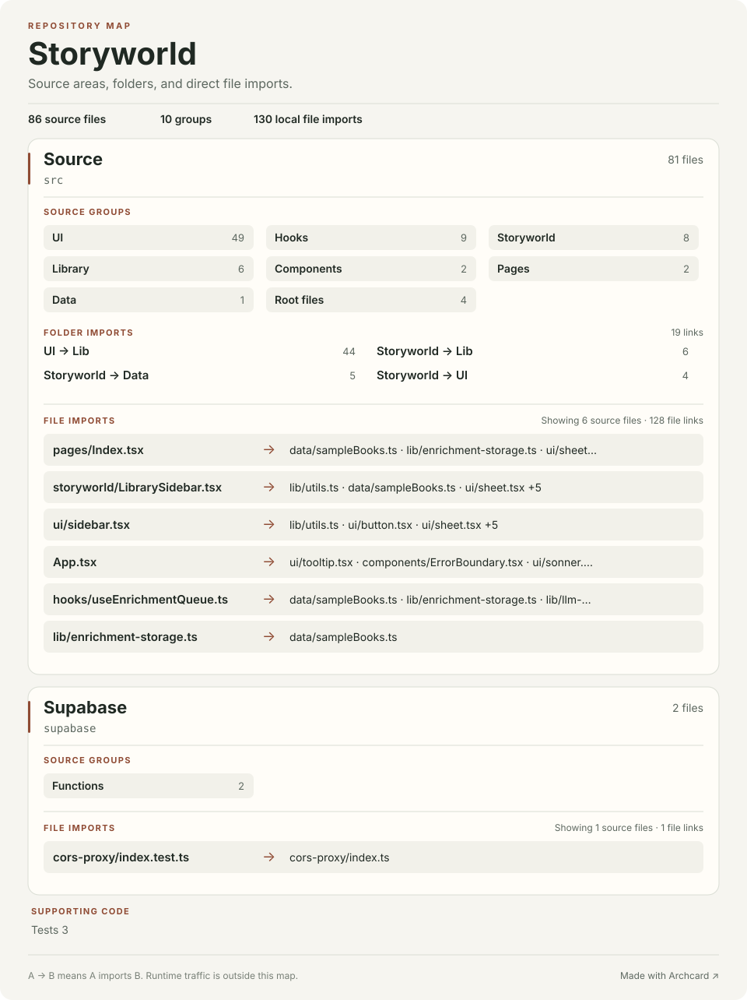

# Storyworld source map

This map comes from source files. An arrow means that one local file imports another. It does not show runtime calls, network traffic, or deployments.

86 source files · 10 groups · 130 direct local file imports

## Folder imports

Each count is the number of source files in the first folder that import from the second folder.

| From | Imports | Source files |
| --- | --- | ---: |
| src/components/ui | src/lib | 44 |
| src/components/storyworld | src/lib | 6 |
| src/components/storyworld | src/data | 5 |
| src/components/storyworld | src/components/ui | 4 |
| src/hooks | src/data | 4 |
| src/hooks | src/lib | 4 |
| src/components/storyworld | src/hooks | 3 |
| src/components/ui | src/hooks | 3 |
| src/lib | src/data | 2 |
| src | src/components | 1 |
| src | src/components/ui | 1 |
| src | src/pages | 1 |
| src/components | src/lib | 1 |
| src/hooks | src/components/ui | 1 |
| src/pages | src/components/storyworld | 1 |
| src/pages | src/components/ui | 1 |
| src/pages | src/data | 1 |
| src/pages | src/hooks | 1 |
| src/pages | src/lib | 1 |
| src/test | src/lib | 1 |

## Source files

### src

#### src/components/ui

49 files · TypeScript

| File | Direct local imports |
| --- | --- |
| [accordion.tsx](../src/components/ui/accordion.tsx) | [lib/utils.ts](../src/lib/utils.ts) |
| [alert-dialog.tsx](../src/components/ui/alert-dialog.tsx) | [button.tsx](../src/components/ui/button.tsx), [lib/utils.ts](../src/lib/utils.ts) |
| [alert.tsx](../src/components/ui/alert.tsx) | [lib/utils.ts](../src/lib/utils.ts) |
| [aspect-ratio.tsx](../src/components/ui/aspect-ratio.tsx) | — |
| [avatar.tsx](../src/components/ui/avatar.tsx) | [lib/utils.ts](../src/lib/utils.ts) |
| [badge.tsx](../src/components/ui/badge.tsx) | [lib/utils.ts](../src/lib/utils.ts) |
| [breadcrumb.tsx](../src/components/ui/breadcrumb.tsx) | [lib/utils.ts](../src/lib/utils.ts) |
| [button.tsx](../src/components/ui/button.tsx) | [lib/utils.ts](../src/lib/utils.ts) |
| [calendar.tsx](../src/components/ui/calendar.tsx) | [button.tsx](../src/components/ui/button.tsx), [lib/utils.ts](../src/lib/utils.ts) |
| [card.tsx](../src/components/ui/card.tsx) | [lib/utils.ts](../src/lib/utils.ts) |
| [carousel.tsx](../src/components/ui/carousel.tsx) | [button.tsx](../src/components/ui/button.tsx), [lib/utils.ts](../src/lib/utils.ts) |
| [chart.tsx](../src/components/ui/chart.tsx) | [lib/utils.ts](../src/lib/utils.ts) |
| [checkbox.tsx](../src/components/ui/checkbox.tsx) | [lib/utils.ts](../src/lib/utils.ts) |
| [collapsible.tsx](../src/components/ui/collapsible.tsx) | — |
| [command.tsx](../src/components/ui/command.tsx) | [dialog.tsx](../src/components/ui/dialog.tsx), [lib/utils.ts](../src/lib/utils.ts) |
| [context-menu.tsx](../src/components/ui/context-menu.tsx) | [lib/utils.ts](../src/lib/utils.ts) |
| [dialog.tsx](../src/components/ui/dialog.tsx) | [lib/utils.ts](../src/lib/utils.ts) |
| [drawer.tsx](../src/components/ui/drawer.tsx) | [lib/utils.ts](../src/lib/utils.ts) |
| [dropdown-menu.tsx](../src/components/ui/dropdown-menu.tsx) | [lib/utils.ts](../src/lib/utils.ts) |
| [form.tsx](../src/components/ui/form.tsx) | [label.tsx](../src/components/ui/label.tsx), [lib/utils.ts](../src/lib/utils.ts) |
| [hover-card.tsx](../src/components/ui/hover-card.tsx) | [lib/utils.ts](../src/lib/utils.ts) |
| [input-otp.tsx](../src/components/ui/input-otp.tsx) | [lib/utils.ts](../src/lib/utils.ts) |
| [input.tsx](../src/components/ui/input.tsx) | [lib/utils.ts](../src/lib/utils.ts) |
| [label.tsx](../src/components/ui/label.tsx) | [lib/utils.ts](../src/lib/utils.ts) |
| [menubar.tsx](../src/components/ui/menubar.tsx) | [lib/utils.ts](../src/lib/utils.ts) |
| [navigation-menu.tsx](../src/components/ui/navigation-menu.tsx) | [lib/utils.ts](../src/lib/utils.ts) |
| [pagination.tsx](../src/components/ui/pagination.tsx) | [button.tsx](../src/components/ui/button.tsx), [lib/utils.ts](../src/lib/utils.ts) |
| [popover.tsx](../src/components/ui/popover.tsx) | [lib/utils.ts](../src/lib/utils.ts) |
| [progress.tsx](../src/components/ui/progress.tsx) | [lib/utils.ts](../src/lib/utils.ts) |
| [radio-group.tsx](../src/components/ui/radio-group.tsx) | [lib/utils.ts](../src/lib/utils.ts) |
| [resizable.tsx](../src/components/ui/resizable.tsx) | [lib/utils.ts](../src/lib/utils.ts) |
| [scroll-area.tsx](../src/components/ui/scroll-area.tsx) | [lib/utils.ts](../src/lib/utils.ts) |
| [select.tsx](../src/components/ui/select.tsx) | [lib/utils.ts](../src/lib/utils.ts) |
| [separator.tsx](../src/components/ui/separator.tsx) | [lib/utils.ts](../src/lib/utils.ts) |
| [sheet.tsx](../src/components/ui/sheet.tsx) | [lib/utils.ts](../src/lib/utils.ts) |
| [sidebar.tsx](../src/components/ui/sidebar.tsx) | [button.tsx](../src/components/ui/button.tsx), [input.tsx](../src/components/ui/input.tsx), [separator.tsx](../src/components/ui/separator.tsx), [sheet.tsx](../src/components/ui/sheet.tsx), [skeleton.tsx](../src/components/ui/skeleton.tsx), [tooltip.tsx](../src/components/ui/tooltip.tsx), [hooks/use-mobile.tsx](../src/hooks/use-mobile.tsx), [lib/utils.ts](../src/lib/utils.ts) |
| [skeleton.tsx](../src/components/ui/skeleton.tsx) | [lib/utils.ts](../src/lib/utils.ts) |
| [slider.tsx](../src/components/ui/slider.tsx) | [lib/utils.ts](../src/lib/utils.ts) |
| [sonner.tsx](../src/components/ui/sonner.tsx) | — |
| [switch.tsx](../src/components/ui/switch.tsx) | [lib/utils.ts](../src/lib/utils.ts) |
| [table.tsx](../src/components/ui/table.tsx) | [lib/utils.ts](../src/lib/utils.ts) |
| [tabs.tsx](../src/components/ui/tabs.tsx) | [lib/utils.ts](../src/lib/utils.ts) |
| [textarea.tsx](../src/components/ui/textarea.tsx) | [lib/utils.ts](../src/lib/utils.ts) |
| [toast.tsx](../src/components/ui/toast.tsx) | [lib/utils.ts](../src/lib/utils.ts) |
| [toaster.tsx](../src/components/ui/toaster.tsx) | [toast.tsx](../src/components/ui/toast.tsx), [hooks/use-toast.ts](../src/hooks/use-toast.ts) |
| [toggle-group.tsx](../src/components/ui/toggle-group.tsx) | [toggle.tsx](../src/components/ui/toggle.tsx), [lib/utils.ts](../src/lib/utils.ts) |
| [toggle.tsx](../src/components/ui/toggle.tsx) | [lib/utils.ts](../src/lib/utils.ts) |
| [tooltip.tsx](../src/components/ui/tooltip.tsx) | [lib/utils.ts](../src/lib/utils.ts) |
| [use-toast.ts](../src/components/ui/use-toast.ts) | [hooks/use-toast.ts](../src/hooks/use-toast.ts) |

#### src/hooks

9 files · TypeScript

| File | Direct local imports |
| --- | --- |
| [use-mobile.tsx](../src/hooks/use-mobile.tsx) | — |
| [use-toast.ts](../src/hooks/use-toast.ts) | [ui/toast.tsx](../src/components/ui/toast.tsx) |
| [useBookLibrary.ts](../src/hooks/useBookLibrary.ts) | [data/sampleBooks.ts](../src/data/sampleBooks.ts) |
| [useEnrichment.ts](../src/hooks/useEnrichment.ts) | [data/sampleBooks.ts](../src/data/sampleBooks.ts), [lib/llm-engine.ts](../src/lib/llm-engine.ts) |
| [useEnrichmentQueue.ts](../src/hooks/useEnrichmentQueue.ts) | [data/sampleBooks.ts](../src/data/sampleBooks.ts), [lib/enrichment-storage.ts](../src/lib/enrichment-storage.ts), [lib/llm-engine.ts](../src/lib/llm-engine.ts) |
| [useLLMChat.ts](../src/hooks/useLLMChat.ts) | [lib/llm-engine.ts](../src/lib/llm-engine.ts) |
| [useNarration.ts](../src/hooks/useNarration.ts) | [data/sampleBooks.ts](../src/data/sampleBooks.ts), [lib/tts-engine.ts](../src/lib/tts-engine.ts) |
| [usePagedReader.ts](../src/hooks/usePagedReader.ts) | — |
| [useReadingProgress.ts](../src/hooks/useReadingProgress.ts) | — |

#### src/components/storyworld

8 files · TypeScript

| File | Direct local imports |
| --- | --- |
| [IntelligencePanel.tsx](../src/components/storyworld/IntelligencePanel.tsx) | [data/sampleBooks.ts](../src/data/sampleBooks.ts), [hooks/useEnrichmentQueue.ts](../src/hooks/useEnrichmentQueue.ts), [hooks/useLLMChat.ts](../src/hooks/useLLMChat.ts), [lib/enrichment-storage.ts](../src/lib/enrichment-storage.ts), [lib/utils.ts](../src/lib/utils.ts) |
| [LibrarySidebar.tsx](../src/components/storyworld/LibrarySidebar.tsx) | [SettingsDialog.tsx](../src/components/storyworld/SettingsDialog.tsx), [ui/alert-dialog.tsx](../src/components/ui/alert-dialog.tsx), [ui/sheet.tsx](../src/components/ui/sheet.tsx), [ui/switch.tsx](../src/components/ui/switch.tsx), [data/sampleBooks.ts](../src/data/sampleBooks.ts), [hooks/use-mobile.tsx](../src/hooks/use-mobile.tsx), [hooks/useEnrichmentQueue.ts](../src/hooks/useEnrichmentQueue.ts), [lib/utils.ts](../src/lib/utils.ts) |
| [NarrationControls.tsx](../src/components/storyworld/NarrationControls.tsx) | [ui/popover.tsx](../src/components/ui/popover.tsx), [lib/tts-engine.ts](../src/lib/tts-engine.ts), [lib/utils.ts](../src/lib/utils.ts) |
| [ReadingPanel.tsx](../src/components/storyworld/ReadingPanel.tsx) | [SentenceRenderer.tsx](../src/components/storyworld/SentenceRenderer.tsx), [ThemeToggle.tsx](../src/components/storyworld/ThemeToggle.tsx), [data/sampleBooks.ts](../src/data/sampleBooks.ts), [hooks/usePagedReader.ts](../src/hooks/usePagedReader.ts), [lib/utils.ts](../src/lib/utils.ts) |
| [SentenceRenderer.tsx](../src/components/storyworld/SentenceRenderer.tsx) | [data/sampleBooks.ts](../src/data/sampleBooks.ts), [lib/utils.ts](../src/lib/utils.ts) |
| [SettingsDialog.tsx](../src/components/storyworld/SettingsDialog.tsx) | [ThemeToggle.tsx](../src/components/storyworld/ThemeToggle.tsx), [ui/alert-dialog.tsx](../src/components/ui/alert-dialog.tsx), [ui/dialog.tsx](../src/components/ui/dialog.tsx) |
| [ThemeToggle.tsx](../src/components/storyworld/ThemeToggle.tsx) | [lib/utils.ts](../src/lib/utils.ts) |
| [WelcomeScreen.tsx](../src/components/storyworld/WelcomeScreen.tsx) | [ThemeToggle.tsx](../src/components/storyworld/ThemeToggle.tsx), [ui/switch.tsx](../src/components/ui/switch.tsx), [data/sampleBooks.ts](../src/data/sampleBooks.ts) |

#### src/lib

6 files · TypeScript

| File | Direct local imports |
| --- | --- |
| [enrichment-storage.ts](../src/lib/enrichment-storage.ts) | [data/sampleBooks.ts](../src/data/sampleBooks.ts) |
| [epub-parser.ts](../src/lib/epub-parser.ts) | [data/sampleBooks.ts](../src/data/sampleBooks.ts) |
| [llm-engine.ts](../src/lib/llm-engine.ts) | [runanywhere-common.ts](../src/lib/runanywhere-common.ts) |
| [runanywhere-common.ts](../src/lib/runanywhere-common.ts) | — |
| [tts-engine.ts](../src/lib/tts-engine.ts) | [runanywhere-common.ts](../src/lib/runanywhere-common.ts) |
| [utils.ts](../src/lib/utils.ts) | — |

#### src/test

3 files · TypeScript

| File | Direct local imports |
| --- | --- |
| [enrichment-flow.test.ts](../src/test/enrichment-flow.test.ts) | [lib/enrichment-storage.ts](../src/lib/enrichment-storage.ts) |
| [example.test.ts](../src/test/example.test.ts) | — |
| [setup.ts](../src/test/setup.ts) | — |

#### src/components

2 files · TypeScript

| File | Direct local imports |
| --- | --- |
| [ErrorBoundary.tsx](../src/components/ErrorBoundary.tsx) | — |
| [NavLink.tsx](../src/components/NavLink.tsx) | [lib/utils.ts](../src/lib/utils.ts) |

#### src/pages

2 files · TypeScript

| File | Direct local imports |
| --- | --- |
| [Index.tsx](../src/pages/Index.tsx) | [storyworld/IntelligencePanel.tsx](../src/components/storyworld/IntelligencePanel.tsx), [storyworld/LibrarySidebar.tsx](../src/components/storyworld/LibrarySidebar.tsx), [storyworld/NarrationControls.tsx](../src/components/storyworld/NarrationControls.tsx), [storyworld/ReadingPanel.tsx](../src/components/storyworld/ReadingPanel.tsx), [storyworld/WelcomeScreen.tsx](../src/components/storyworld/WelcomeScreen.tsx), [ui/sheet.tsx](../src/components/ui/sheet.tsx), [data/sampleBooks.ts](../src/data/sampleBooks.ts), [hooks/use-mobile.tsx](../src/hooks/use-mobile.tsx), [hooks/useBookLibrary.ts](../src/hooks/useBookLibrary.ts), [hooks/useEnrichmentQueue.ts](../src/hooks/useEnrichmentQueue.ts), [hooks/useNarration.ts](../src/hooks/useNarration.ts), [hooks/useReadingProgress.ts](../src/hooks/useReadingProgress.ts), [lib/enrichment-storage.ts](../src/lib/enrichment-storage.ts), [lib/epub-parser.ts](../src/lib/epub-parser.ts), [lib/tts-engine.ts](../src/lib/tts-engine.ts) |
| [NotFound.tsx](../src/pages/NotFound.tsx) | — |

#### src/data

1 file · TypeScript

| File | Direct local imports |
| --- | --- |
| [sampleBooks.ts](../src/data/sampleBooks.ts) | — |

#### src

4 files · CSS

| File | Direct local imports |
| --- | --- |
| [App.css](../src/App.css) | — |
| [App.tsx](../src/App.tsx) | [components/ErrorBoundary.tsx](../src/components/ErrorBoundary.tsx), [ui/sonner.tsx](../src/components/ui/sonner.tsx), [ui/tooltip.tsx](../src/components/ui/tooltip.tsx), [pages/Index.tsx](../src/pages/Index.tsx), [pages/NotFound.tsx](../src/pages/NotFound.tsx) |
| [index.css](../src/index.css) | — |
| [main.tsx](../src/main.tsx) | [App.tsx](../src/App.tsx), [index.css](../src/index.css) |

### supabase

#### supabase/functions

2 files · TypeScript

| File | Direct local imports |
| --- | --- |
| [index.test.ts](../supabase/functions/cors-proxy/index.test.ts) | [index.ts](../supabase/functions/cors-proxy/index.ts) |
| [index.ts](../supabase/functions/cors-proxy/index.ts) | — |

A missing arrow does not prove that two files are independent. Archcard recognizes common JavaScript, TypeScript, Python, and Rust import forms. [Made with Archcard](https://github.com/skipauthenticate/archcard).
